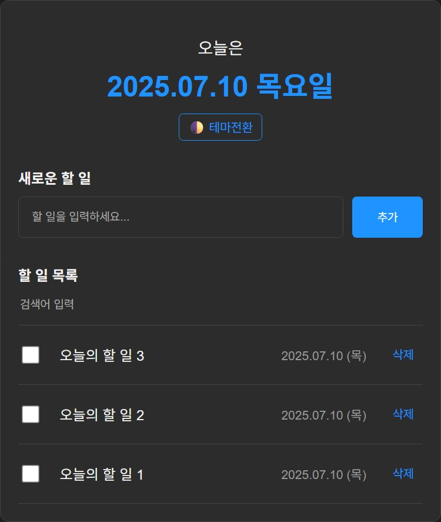
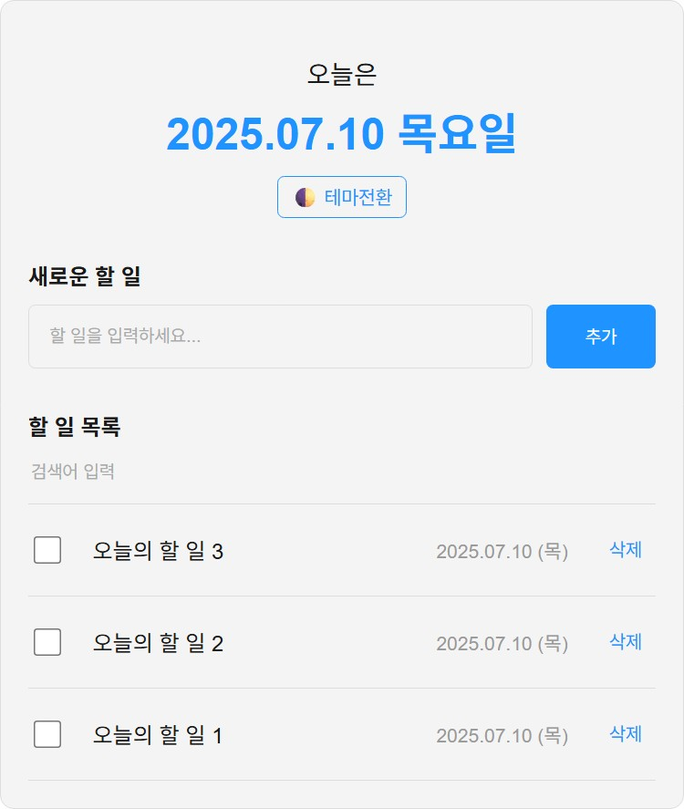

# 📝 Todo List App (React)

모던한 다크 테마의 심플한 Todo 리스트 앱입니다.  
할 일 추가, 검색, 테마 전환, 반응형 레이아웃까지 지원합니다.

---

## 📸 다크모드 미리보기



## 📸 라이트모드 미리보기



---

## 🔥 주요 기능

- 할 일 추가 / 완료 체크 / 삭제
- 실시간 검색 필터링
- 다크/라이트 테마 전환 버튼
- 반응형 레이아웃 (모바일 최적화)
- 날짜 형식: `2025.07.10 (목)`
- 부드러운 fade-in 애니메이션

---

## ⚙️ 실행 방법

### 1) 클라이언트 실행
```bash
cd client
npm install
npm start
```

### 2) 서버 실행 (JSON Server)
```bash
cd server
npm install
npm start
```

- 클라이언트는 기본 포트 3000
- 서버는 기본 포트 5000에서 작동

---

## 🛠 기술 스택

- React (CRA 기반)
- CSS (커스텀 다크 테마 + 애니메이션)
- Axios
- JSON Server

---

## 📁 프로젝트 구조

```
client/
├── public/
│   ├── index.html
│   └── favicon.png
├── src/
│   ├── App.js / App.css
│   ├── index.js / index.css
│   ├── component/
│   │   ├── Header.js / Header.css
│   │   ├── TodoEditor.js / TodoEditor.css
│   │   ├── TodoItem.js / TodoItem.css
│   │   └── TodoList.js / TodoList.css

server/
├── index.js
├── package.json
```

---

## 👤 개발자

- GitHub: [noooopa](https://github.com/noooopa)